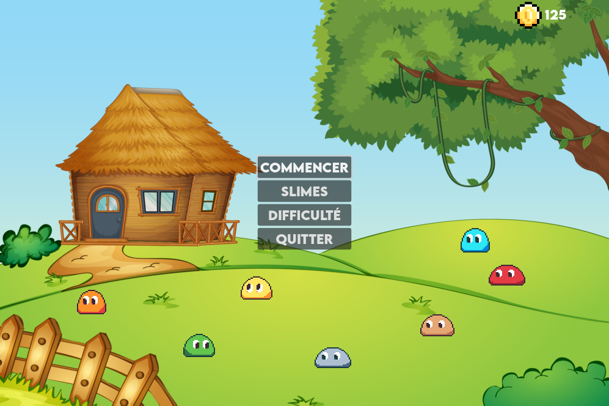
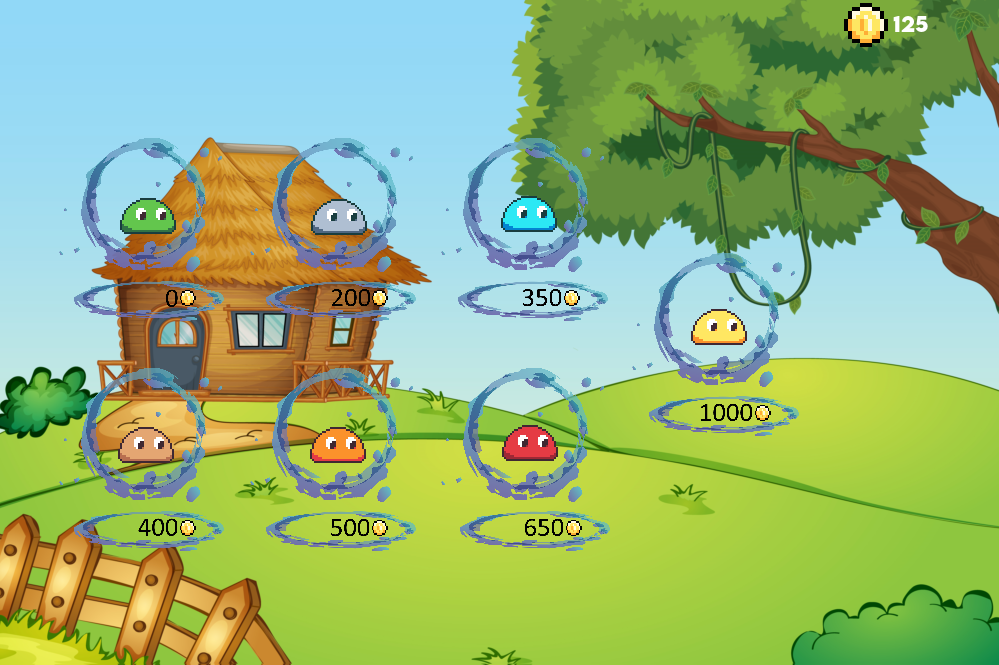
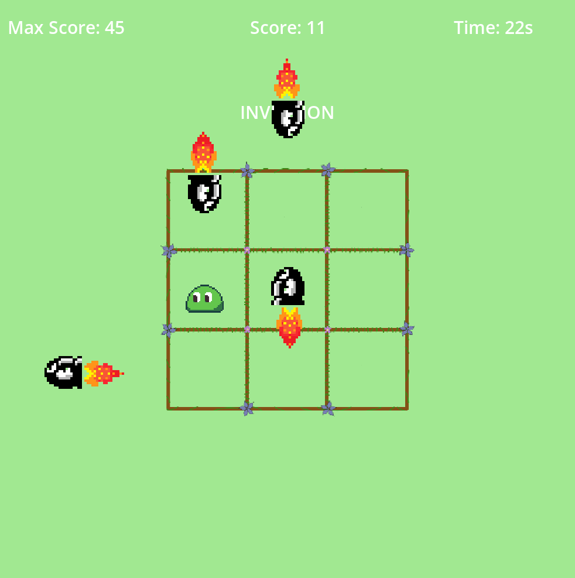

# BlackSquare

BlackSquare est un jeu interactif développé grâce au moteur de jeu Godot. Le concept du jeu repose sur la manipulation d'un personnage **slime** sur une grille structurée à la manière d'un morpion de 3x3. L'objectif principal est d'éviter avec précision et dextérité une multitude de projectiles, dont la fréquence et la densité augmentent progressivement au fil de la progression.

BlackSquare comporte un menu utilisateur ainsi qu'une boutique intégrée, permettant l'acquisition de divers **slimes**. Par ailleurs, le jeu propose une variété de niveaux de difficulté, conçus pour mettre à l'épreuve les compétences et la détermination de chaque joueur.

- Facile : Une simple introduction au jeu, ce niveau de difficulté permet aux joueurs de se familiariser avec les commandes de base et les mécanismes de jeu.
- Normal : Dans ce niveau de difficulté, les joueurs peuvent s'attendre à une inversion occasionnelle des commandes de direction.
- Difficile : Le niveau le plus exigeant, où les joueurs doivent non seulement composer avec des commandes inversées, mais aussi faire face à des périodes d'obscurité totale, ne révélant que les projectiles entrants.

## Différents apperçus du jeu

## Exécution du jeu

Deux versions compilées sont disponibles, une pour Linux et une pour Windows. Ils sont disponibles dans le dossier `build` du projet.

## Licence
Ce projet n'est pas sous licence, vous pouvez donc le modifier et le redistribuer comme bon vous semble. Ce jeu a été conçu comme un outil pédagogique, son objectif, premier est de faciliter l'apprentissage et de servir d'introduction à l'utilisation du moteur de jeu Godot.
